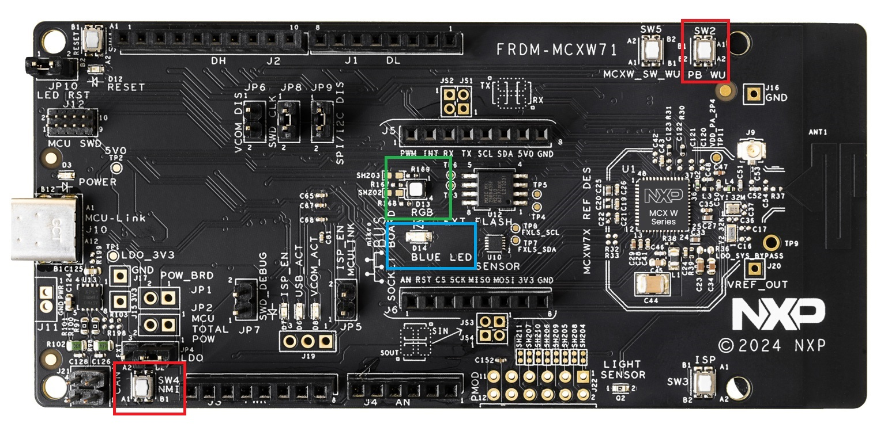
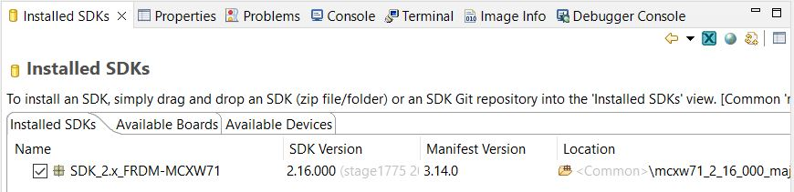
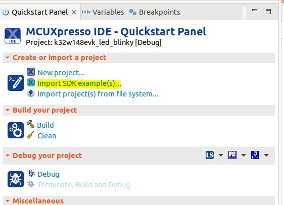
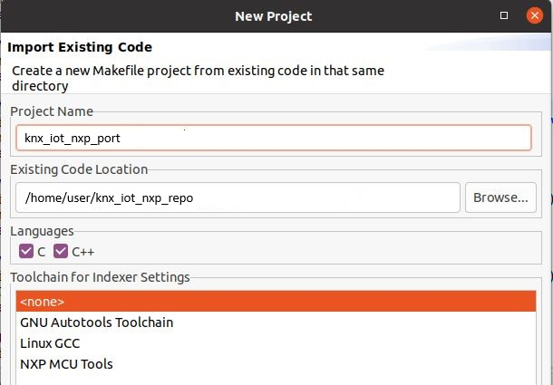
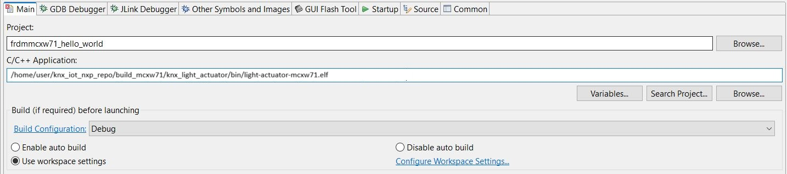

# NXP Application Code Hub
[](https://www.nxp.com)

## KNX IoT stack examples running on FRDM-MCXW71

The application examples in this repository are FreeRTOS based applications running the open source KNX IoT stack on NXP OpenThread enabled platforms such as [NXP FRDM-MCXW71](https://www.nxp.com/design/design-center/development-boards-and-designs/FRDM-MCXW71).

The demo applications are light_sensor (simulating a KNX light switched sensor basic application - LSSB from the KNX IoT stack repo) and light_actuator (simulating a KNX switched actuator basic application - LSAB  from the KNX IoT stack repo).

#### Boards: FRDM-MCXW71
#### Categories: Wireless Connectivity
#### Peripherals: UART
#### Toolchains: GCC

## Table of Contents
1. [Software](#step1)
2. [Hardware](#step2)
3. [Setup](#step3)
    1. [Cloning and setting up the build environment](#step3.1)
    2. [Building the examples](#step3.2)
    3. [Flashing the FRDM-MCXW71 board](#step3.3)
    4. [Debugging](#step3.4)
    5. [Running the KNX demos](#step3.5)
4. [Support](#step4)
5. [Release Notes](#step5)

## 1. Software<a name="step1"></a>

The build system is based on the ot-nxp repository build system. Supported development and build environments are:
- Linux OS
- Windows OS using WSL (recommending using Ubuntu 22.04 WSL)

The build system uses `cmake`, `ninja` and `gcc` for ARM. These can be installed using the dedicated environment setup script inside the repository. For more details, please refer to the [ot-nxp repository](https://github.com/NXP/ot-nxp).

Another required tool is `git`, used to pull the repository code.

[Secure Provisioning SDK tool (SPSDK)](https://www.nxp.com/design/design-center/software/development-software/secure-provisioning-sdk-spsdk:SPSDK)<a name="spsdk"></a> is required to handle NBU updates. This tool can be installed using Python:

```
$ pip install spsdk
```

Note: There might be some dependencies that cause conflicts with already
installed Python modules. However, `blhost` tool is still installed and can
be used.

> **_Note on Windows and WSL:_** Windows Subsystem for Linux doesn't map the connected USB devices automatically. As workaround, user needs to use the WSL console for the application build and the Windows command prompt/Power Shell to work with blhost and Jlink that write the required binaries to the boards.

For debugging purpose, [MCUXpresso IDE](https://www.nxp.com/design/design-center/software/development-software/mcuxpresso-software-and-tools-/mcuxpresso-integrated-development-environment-ide:MCUXpresso-IDE) needs to be installed.

MCUXpresso SDK 2.16.100 for FRDM-MCXW71 is required and can be downloaded as zip file from the [MCUXpresso SDK page](https://mcuxpresso.nxp.com/en/select).

## 2. Hardware<a name="step2"></a>
- [NXP FRDM-MCXW71](https://www.nxp.com/design/design-center/development-boards-and-designs/FRDM-MCXW71)



- Personal computer
- USB Type C cable

A minimum of two boards are required to exercise the demo applications.

### Device UI

The state feedback on the light_actuator board is provided through LED effects:

| widget  | effect        | state                                                          | description    |
| ------- | ------------- | -------------------------------------------------------------- | -------------------------------------- |
| RGB LED | Green on/off  |  commissioned to Thread network and KNX application configured | RGB LED will toggle the Green light on/off whenever the KNX CoAP message with `/p/o_1_1` uri path is received |
| Monochrome LED | Blue on/off | commissioned to Thread network and KNX application configured | Monochrome LED will toggle the Blue light on/off whenever the KNX CoAP message with `/p/o_1_2` uri path is received |

The user actions on the light_sensor board are summarized below:

| button | action      | state                                                         | output       |
| ------ | ----------- | ------------------------------------------------------------- | ------------ |
| SW2    | short press | commissioned to Thread network and KNX application configured | The device will send out a multicast KNX message over Thread, using CoAP and `/p/o_1_1` uri path  |
| SW4    | short press | commissioned to Thread network and KNX application configured | The device will send out a multicast KNX message over Thread, using CoAP and `/p/o_1_2` uri path  |

## 3. Setup<a name="step3"></a>
### 3.1 Step 1 - Cloning and setting up the build environment<a name="step3.1"></a>

Clone the repository inside your workspace:
```
git clone https://github.com/nxp-appcodehub/dm-knx-iot-examples-on-nxp-mcxw71.git
```

An environment setup script is available in the root of the repository. The script's possible parameters can be listed by issuing in the CLI the `./environment_setup.sh` command:

```bash
$ ./environment_setup.sh
This is a setup script to set the NXP port of KNX IoT OpenThread examples environment.
Usage: ./environment_setup.sh clean|setup_repos|setup_tools|apply_ot_patch
```

User can use the script to either set up the subrepositories, set up the build environment tools and SDKs or to clean the repositories.

- Example of output for command to setting up the repositories:
```bash
$  ./environment_setup.sh setup_repos
This is a setup script to set the NXP port of KNX IoT OpenThread examples environment.
Setting up the repositories.
The script will update all repositories (ot-nxp and NXP SDK).
The setup will take several minutes to complete.
Setting up submodules.
Submodule 'KNX-IOT-STACK' (https://github.com/KNX-IOT/KNX-IOT-STACK.git) registered for path 'KNX-IOT-STACK'
Submodule 'ot-nxp' (https://github.com/NXP/ot-nxp.git) registered for path 'ot-nxp'
Cloning into '/home/user/knx_iot_nxp_repo/KNX-IOT-STACK'...
Cloning into '/home/user/knx_iot_nxp_repo/ot-nxp'...
Submodule path 'KNX-IOT-STACK': checked out '270890a6cfab8ab0ff92cd155cc2be11ff36b4bb'
Submodule path 'ot-nxp': checked out 'dfbe12280af4a87cb9ae0c0c1d90d71de3372d82'
Submodule 'deps/gtest' (https://github.com/google/googletest.git) registered for path 'KNX-IOT-STACK/deps/gtest'
Submodule 'deps/mbedtls' (https://github.com/ARMmbed/mbedtls.git) registered for path 'KNX-IOT-STACK/deps/mbedtls'
Submodule 'deps/tinycbor' (https://github.com/intel/tinycbor.git) registered for path 'KNX-IOT-STACK/deps/tinycbor'
Cloning into '/home/user/knx_iot_nxp_repo/KNX-IOT-STACK/deps/gtest'...
Cloning into '/home/user/knx_iot_nxp_repo/KNX-IOT-STACK/deps/mbedtls'...
Cloning into '/home/user/knx_iot_nxp_repo/KNX-IOT-STACK/deps/tinycbor'...
Submodule path 'KNX-IOT-STACK/deps/gtest': checked out 'c99458533a9b4c743ed51537e25989ea55944908'
Submodule path 'KNX-IOT-STACK/deps/mbedtls': checked out 'd81c11b8ab61fd5b2da8133aa73c5fe33a0633eb'
Submodule path 'KNX-IOT-STACK/deps/tinycbor': checked out '70aba6ba51881e5b8d108c105a17ed9cdee6bc30'
Submodule path 'ot-nxp': checked out 'ce3f5e4752efb3a4e3ca03887f7c8c0f2d841980'
Submodule 'openthread' (https://github.com/NXP/openthread.git) registered for path 'ot-nxp/openthread'
Cloning into '/home/user/knx_iot_nxp_repo/ot-nxp/openthread'...
Submodule path 'ot-nxp/openthread': checked out '4cc1ffd17439db6e0b97b010ad00043d7509f246'
Setting up submodules done.
Patching ot-nxp repo.
ot-nxp repo has been patched!
Pulling NXP SDK.
=== Initializing from existing manifest repository manifest
--- Creating /home/user/knx_iot_nxp_repo/ot-nxp/third_party/github_sdk/.west and local configuration file
=== Initialized. Now run "west update" inside /home/user/knx_iot_nxp_repo/ot-nxp/third_party/github_sdk.
=== updating sdk-release (core):
--- sdk-release: initializing
Initialized empty Git repository in /home/user/knx_iot_nxp_repo/ot-nxp/third_party/github_sdk/core/.git/
--- sdk-release: fetching, need revision MCUX_2.16.100
...
```

- Example of output for command to clean the repositories (setting up the repositories before is required):
```bash
$ ./environment_setup.sh clean
This is a setup script to set the NXP port of KNX IoT OpenThread examples environment.
Cleaning the environment.
Resetting ot-nxp repository.
HEAD is now at ce3f5e4 [common] Enable Dns over TCP feature for Thread 1.4
Cleaning NXP SDK.
=== running "git reset --hard && git clean -xdf" in sdk-release (core):
...
```

- Example of output for command to setting up the build toolchain:
```bash
$ ./environment_setup.sh setup_tools
This is a setup script to set the NXP port of KNX IoT OpenThread examples environment.
Setting up the toolchain.
The script will update the toolchain.
The setup will take several minutes to complete.
Setting up ot-nxp toolchain environment.
+ main
++ dirname ./script/bootstrap
...
```

> **_Note:_** On Windows WSL, `pip install <package>` commands can return `error: externally-managed-environment`. This can be fixed by running the `pip install` command with
`--break-system-packages` added as argument at the end of the command. For example, `pip install west --break-system-packages`.

- Certain changes to the ot-nxp repository are required. These changes will be integrated in next releases. This is why for this demo, there is a patch required to be applied on the ot-nxp repository. Example of output for command to patch ot-nxp repo:
```bash
$ ./environment_setup.sh apply_ot_patch
This is a setup script to set the NXP port of KNX IoT OpenThread examples environment.
Applying ot-nxp repo patch.
ot-nxp repo has been patched!
```

### 3.2 Step 2 - Building the examples<a name="step3.2"></a>

The build scripts are found in the `script` folder. To build all available KNX IoT applications for an NXP platform such as MCXW71, user needs to run the following command
from the root of the repository:

```bash
$ ./script/build_mcxw71_knx
```

To build just one particular application, such as `light_sensor` or `light_actuator`, user needs to add to the previous command the desired application through the keywords `knx_light_sensor`
and `knx_light_actuator`.

```bash
$ ./script/build_mcxw71_knx knx_light_sensor
```

The output of the build is found in the `build_mcxw71` folder, having two separate subfolders, `build_mcxw71/knx_light_sensor` and `build_mcxw71/knx_light_actuator`. The elf and binary files
for the build are found in the `bin` subfolder for each application.

### 3.3 Step 3 - Flashing the FRDM-MCXW71 board<a name="step3.3"></a>

Two images must be written to the board: one for the host (CM33) and one for the `NBU` (CM3).

### Flashing the `NBU` image

`NBU` image should be written only when a new NXP SDK is released. [SPSDK](#spsdk) needs to be installed before this step.

    It is necessary to work with the matching `NBU` image for the SDK version of
    the application you are working with. This means that when you download your
    SDK, prior to loading any wireless SDK example, update your `NBU` image with
    the SDK provided binaries. For `FRDM` users, please write the following
    binary:

    `middleware/wireless/ieee-802.15.4/bin/mcxw71/mcxw71_nbu_ble_15_4_dyn_matter_<nbu_version>.sb3`

    Please note that `<nbu_version>` may vary depending on the SDK version. The tested NBU binary from SDK 2.16.100 is version `1_0_17_2`.

    1. Before writing the image, please make sure that MCXW71 is in `ISP` mode by keeping the `SW3` button (also named `ISP`) pressed while connecting the MCXW71 board to an USB port (unplug the board if already connected to an USB port).

    2. Once the device is connected, you may find the assigned port by running:

        ```
        nxpdevscan
        ```

    3. Run the `blhost` command to write the `sb3` file:

        ```
        blhost -p <assigned_port> receive-sb-file <path_to_SDK>/middleware/wireless/ieee-802.15.4/bin/mcxw71/mcxw71_nbu_ble_15_4_dyn_matter_<nbu_version>.sb3
        ```
        An example `<path_to_SDK>` is `/home/user/knx_iot_nxp_repo/ot-nxp/third_party/github_sdk`.

### Flashing the host image

Host image is the one found under `build_mcxw71/knx_light_actuator/bin` or `build_mcxw71/knx_light_actuator/bin`. It should be written after each
build process.

If debugging is needed then jump directly to the [Debugging](#debugging)
section. Otherwise, if only flashing is needed then
[JLink](https://www.segger.com/downloads/jlink/) can be used:

-   Plug `MCXW71` to the USB port (no need to keep the `SW3` button pressed
    while doing this, e.g. ISP mode is not needed for host flashing)

-   Connect JLink to the device:

    ```bash
    JLinkExe -device MCXW71 -if SWD -speed 4000 -autoconnect 1
    ```

-   Run the following commands:
    ```bash
    reset
    halt
    loadfile light-actuator-mcxw71.srec
    reset
    go
    quit
    ```

### 3.4 Step 4 - Debugging<a name="step3.4"></a>

One option for debugging is using MCUXpresso IDE.

-   Drag-and-drop the zip file containing the NXP SDK for FRDM-MCXW71 in the "Installed SDKs"
    tab:



-   Import any demo application from the installed SDK:

```
Import SDK example(s).. -> choose a demo app (demo_apps -> hello_world) -> Finish
```



-   Flash the previously imported demo application on the board:

```
Right click on the application (from Project Explorer) -> Debug as -> JLink/CMSIS-DAP
```

After this step, a debug configuration specific for the `MCXW71` board was
created. This debug configuration will be used later on for debugging the
application resulted after ot-nxp compilation.

-   Import KNX IoT NXP port repo in MCUXpresso IDE as Makefile Project. Use _none_ as
    _Toolchain for Indexer Settings_:

```
File -> Import -> C/C++ -> Existing Code as Makefile Project
```



-   Replace the path of the existing demo application with the path of the
    `MCXW71` application:

```
Run -> Debug Configurations... -> C/C++ Application
```



### 3.5 Step 5 - Running the KNX demos<a name="step3.5"></a>

Please see:
- [simple KNX demo guide](docs/knx_demo_nxp.md)
- [KNX with OTBR demo guide](docs/knx_demo_nxp_otbr.md)
- [two KNX boads with OTBR demo guide](docs/two_knx_demo_nxp_otbr.md)

For details about the KNX shell, see the [KNX shell documentation](docs/knx_shell_help.md).

## 4. Support<a name="step4"></a>
- Reach out to NXP Wireless Community page for more support - [NXP Wireless Community](https://community.nxp.com/t5/Wireless-MCU/bd-p/wireless-connectivity)
- KNX IoT Stack introduction - [KNX IoT stack](https://www.knxtoday.com/2023/11/48537/knx-iot-part-7-the-open-source-knx-iot-stack.html)
- Introduction to KNX IoT from KNX association - [KNX IoT](https://www.knxtoday.com/2023/01/45274/knx-iot-part-1-an-introduction.html)
- Latest KNX IoT Point API Stack development - [KNX IoT Point API](https://gitlab.knx.org/public-projects/knx-iot-point-api-stack)

#### Project Metadata

<!----- Boards ----->
[]()

<!----- Categories ----->
[](https://mcuxpresso.nxp.com/appcodehub?category=wireless_connectivity)

<!----- Peripherals ----->
[](https://mcuxpresso.nxp.com/appcodehub?peripheral=uart)

<!----- Toolchains ----->
[](https://mcuxpresso.nxp.com/appcodehub?toolchain=gcc)

Questions regarding the content/correctness of this example can be entered as Issues within this GitHub repository.

>**Warning**: For more general technical questions regarding NXP Microcontrollers and the difference in expected functionality, enter your questions on the [NXP Community Forum](https://community.nxp.com/)

[](https://www.youtube.com/NXP_Semiconductors)
[](https://www.linkedin.com/company/nxp-semiconductors)
[](https://www.facebook.com/nxpsemi/)
[](https://x.com/NXP)

## 7. Release Notes<a name="step7"></a>
| Version | Description / Update                           | Date                        |
|:-------:|------------------------------------------------|----------------------------:|
| 1.0     | Initial release on Application Code Hub        | January 31<sup>st</sup> 2025 |
| 1.1     | KNX IoT stack reference, application and readme        | April 8<sup>st</sup> 2025 |

## Licensing

*If applicable - note software licensing here with links to licenses, otherwise remove this section*

## Origin

*if applicable - note components your application uses regarding to license terms - with authors / licenses / links to licenses, otherwise remove this section*