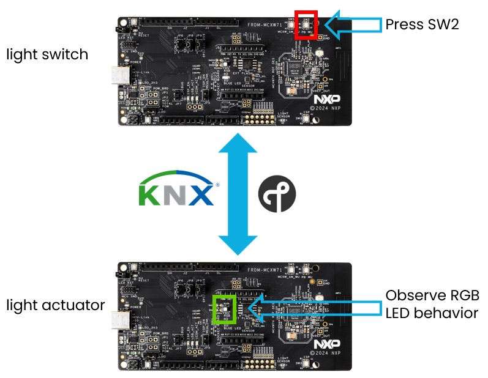
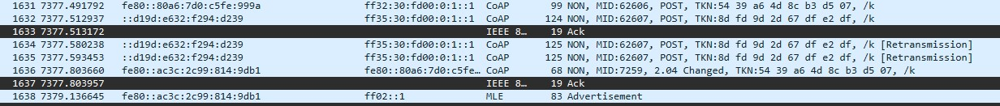

# KNX IoT demo running on FRDM-MCXW71

The KNX IoT demo consists of running the KNX IoT protocol over Thread using two or more devices.
The minimum number of required devices are two. In our case, these will be two FRDM-MCXW71, one running the light_sensor example and the other running the light_actuator example.



The basic demo allows pressing a switch on the light_sensor application to trigger a KNX communication over Thread to the light_actuator application, triggering the change of state of an onboard LED.

## Running the example

1. Prepare two boards with the light sensor and light actuator firmwares. Flashing is described in the `Flashing the FRDM-MCXW71 board` section from the [readme](../README.md).
2. The CLI example uses UART connection. To view raw UART output, start a terminal emulator like PuTTY and connect to the used COM port with the following UART settings:

   - Baud rate: 115200
   - 8 data bits
   - 1 stop bit
   - No parity
   - No flow control

3. Open a terminal connection on the first board and start a new Thread network.

```bash
> knx_factoryreset
Done
> dataset init new
Done
> dataset channel 17
Done
> dataset networkkey 00112233445566778899aabbccddeeff
Done
> dataset panid 0xabcd
Done
> dataset commit active
Done
> ifconfig up
Done
> thread start
Done
```

4. After a couple of seconds the node will become a Leader of the network.

```bash
> state
Leader
```

5. Open a terminal connection on the second board and attach a node to the network.

```bash
> knx_factoryreset
Done
> dataset channel 17
Done
> dataset networkkey 00112233445566778899aabbccddeeff
Done
> dataset panid 0xabcd
Done
> dataset commit active
Done
> ifconfig up
Done
> thread start
Done
```

6. After a couple of seconds the second node will attach and become a Child.

```bash
> state
Child
```

At this point, the boards are connected to the same Thread network and communication between them can be initiated.

## Setting up KNX parameters

On the KNX application level, some settings are needed to be done from the CLI on both devices in order to establish the KNX communication. This can be exercised using the implemented KNX shell commands. Details about the available KNX shell commands can be found [here](knx_shell_help.md).
A simple example of configuration for the KNX light_actuator and light_sensor devices is shown below. This needs to be done after devices are connected to the Thread network. 

1. On the light_sensor board, enter in the CLI interface:
```
> knx_ia 1
Done
> knx_iid 1
iid set:
1
Done
> knx_got add 0 /p/o_1_1 20 ga 1
D: oc_knx_fp.c <oc_dump_group_object_table_entry:1861>:
oc_dump_group_object_table_entry: dumped current state [GOT_STORE_0] [0]: size 19
oc_register_group_multicasts: mport 0

 oc_register_group_multicasts index=0 i=0 group: 1  cflags=
  oc_create_multicast_group_address_with_port S=2 iid=lu G=1 B4=0 B3=1 B2=0 B1=0


coap://[ff32:0030:fd00:0000:0001:0000:0000:0001]:0
  oc_create_multicast_group_address_with_port S=5 iid=lu G=1 B4=0 B3=1 B2=0 B1=0


coap://[ff35:0030:fd00:0000:0001:0000:0000:0001]:0
Done
>
```

2. On the light_actuator board, enter in the CLI interface:
```
> knx_ia 2
Done
> knx_iid 1
iid set:
1
Done
> knx_got add 0 /p/o_1_1 20 ga 1
D: oc_knx_fp.c <oc_dump_group_object_table_entry:1861>:
oc_dump_group_object_table_entry: dumped current state [GOT_STORE_0] [0]: size 19
oc_register_group_multicasts: mport 0

 oc_register_group_multicasts index=0 i=0 group: 1  cflags=
  oc_create_multicast_group_address_with_port S=2 iid=lu G=1 B4=0 B3=1 B2=0 B1=0


coap://[ff32:0030:fd00:0000:0001:0000:0000:0001]:0
  oc_create_multicast_group_address_with_port S=5 iid=lu G=1 B4=0 B3=1 B2=0 B1=0


coap://[ff35:0030:fd00:0000:0001:0000:0000:0001]:0
Done
```

> **_Note:_** Setting the individial address (IA), the installation id (IID) and the group address (GA) correctly is imported. IA and GA are required to be the same for all devices, while IA needs to be particular for each device. In this particular case, IID is 1 and GA is 1 for all KNX IoT devices.

3. On the light_sensor board, press switch marked SW2 and observe the toggle of the RGB LED on the light_actuator board to green.

Over the wireless medium, the packets can be seen with Wireshark and a Thread sniffer. Communication between the boards when pressing the button should look like in the picture below:



In case user desires to exercise the mapping of one button to two LEDs on the actuator, the following command needs to be entered in the shell interface of the light actuator:
```
> knx_got add 0 /p/o_1_2 20 ga 1
```

This enables the mapping of the Monochrome LED marked D1 to be toggled at the same time with the RGB LED. One press on the SW2 button from the light sensor board will toggle both LEDs at the same time.
