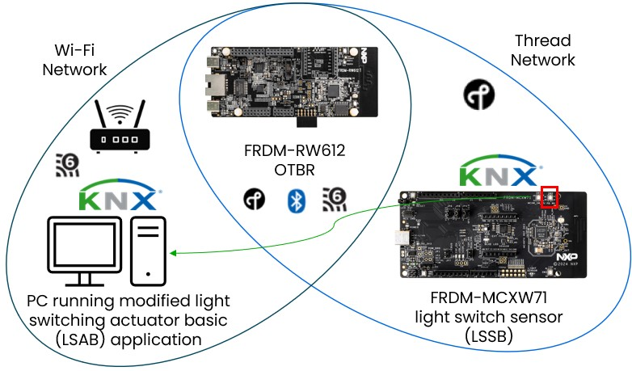

# KNX IoT demo with NXP OpenThread Border Router

This demo requires an additional board acting as OpenThread border Router (OTBR). The device used in the demo is [NXP FRDM-RW612](https://www.nxp.com/design/design-center/development-boards-and-designs/FRDM-RW612).

The demo consists in establishing KNX communication between two devices that are not in the same wireless network.

Showcased below is the scenario of a PC running the Light Switched Actuator Basic (LSAB) application from the KNX IoT repository modified to support multicast communication from the KNX light switched sensor basic (LSSB) application running on the NXP FRDM-MCXW71 in the Thread network. The PC is connected to a WiFi network and the link between the WiFi and Thread realms is done using a NXP FRDM-RW612 running the OTBR firmware.



Instructions for building and flashing the FRDM-RW612 with the OpenThread Border Router firmware can be found [here](https://github.com/NXP/ot-nxp/blob/release/v1.4.0/examples/br/README-OTBR.md).

To connect to the WiFi network, user can use the following CLI command:
```
> wifi connect <wifi_ssid> <wifi_passwd>
Wi-fi link is now up
Done
```

The OpenThread configuration on the border router can be done via CLI:

```
> dataset init new
Done
> dataset channel 17
Done
> dataset networkkey 00112233445566778899aabbccddeeff
Done
> dataset meshlocalprefix fd00:db8::
Done
> dataset panid 0xabcd
Done
> dataset commit active
Done
> prefix add fd11:22::/64 pasor
Done
> ifconfig up
Done
> thread start
Done
```

The OpenThread configuration on the light sensor application is the same as in the previous demo. The KNX configuration is also the same as before. Details about the available KNX shell commands can be found [here](knx_shell_help.md).

```
dataset init new

dataset channel 17

dataset networkkey 00112233445566778899aabbccddeeff

dataset panid 0xabcd

dataset commit active

ifconfig up

thread start

knx_ia 1

knx_iid 1

knx_got add 0 /p/o_1_1 20 ga 1
```

On the LSAB application running on the PC, due to the limited functionality of the application, some changes are required. These changes consist in calling the APIs to set the individual address (ia), installation id (iid) and group object table entry (got) in the application on startup and compiling the application with OC_OSCORE_ENABLED flag set to OFF.

A git diff of the changes for the lsab_minimal application is pasted below:
```
~/KNX-IOT-STACK$ git diff
diff --git a/apps/lsab_minimal_all.c b/apps/lsab_minimal_all.c
index 4a63f683..2247ba33 100644
--- a/apps/lsab_minimal_all.c
+++ b/apps/lsab_minimal_all.c
@@ -646,6 +646,25 @@ main(int argc, char *argv[])
         "connections.\n",
         MY_NAME);
+  oc_core_set_device_ia(0,3);
+  oc_core_set_device_iid(0, 1);
+
+  int ga_values[1] = {1};
+  oc_string_t href;
+  oc_new_string(&href, "/p/o_1_1", strlen("/p/o_1_1"));
+
+  oc_group_object_table_t entry;
+  entry.cflags = 20;
+  entry.id = 0;
+  entry.href = href;
+  entry.ga_len = 1;
+  entry.ga = (int *)&ga_values;
+
+  oc_core_set_group_object_table(0, entry);
+  oc_dump_group_object_table_entry(0);
+  oc_register_group_multicasts();
+  oc_free_string(&entry.href);
+
#ifdef WIN32
   /* windows specific loop */
   while (quit != 1) {
```

> **_Note:_** Setting the individual address (IA), the installation id (IID) and the group address (GA) correctly is imported. IA and GA are required to be the same for all devices, while IA needs to be particular for each device. In this particular case, IID is 1 and GA is 1 for all KNX IoT devices.

Building the application with OSCORE disabled can be done by passing "-DOC_OSCORE_ENABLED=OFF" to the cmake command during build.

The build on Windows or Linux has as prerequisites installing the following:
- [CMake](https://cmake.org/) (>=3.16)
- [Git](https://git-scm.com/)
- [Python 3](https://www.python.org/) (>=3.8)
- Optional: [OpenSSL](https://openssl-library.org/) (if TLS is required)

Over Windows, each application needs to be installed using the dedicated installer, while on Linux, the following command can be issued in terminal:
```
sudo apt update
sudo apt install build-essential cmake git pkg-config libssl-dev libmbedtls-dev libcoap3 libcoap3-dev
```

After cloning the KNX IoT stack code, the build can be done using the following steps in command prompt or terminal:
```
- Windows:
<cd to KNX IoT Stack folder>
mkdir build
cd build
cmake .. -DOC_OSCORE_ENABLED=OFF
cmake --build . --config Release
<the resulting apps will be available in apps\Release\ folder>
```

```
- Linux:
<cd to KNX IoT Stack folder>
mkdir build
cd build
cmake .. -DCMAKE_BUILD_TYPE=Release -DOC_OSCORE_ENABLED=OFF
make -j$(nproc)
<the resulting apps will be available in apps/ folder>
```

After setting up the OTBR, connecting the KNX devices to the networks and starting the LSAB PC application, user can press the light sensor's SW2 button and observe the output of the application on the PC.

Example output:

```
~/KNX-IOT-STACK/build$ ./apps/lsab_minimal_all
argv[0] = ./apps/lsab_minimal_all
KNX-IOT Server name : "Actuator (LSAB) 417"
Current working dir: /home/user/Documents/KNX-IOT-STACK/build
	storage at './LSAB_minimal_creds'
	Creating storage directory at LSAB_minimal_creds
D: oc_buffer.c <process_thread_message_buffer_handler:218>: Started buffer handler process
D: oc_discovery.c <oc_create_discovery_resource:649>: resources for dev 0 created statically
D: oc_knx_dev.c <oc_create_knx_device_resources:1534>: oc_create_knx_device_resources
D: oc_knx_dev.c <oc_create_knx_device_resources:1537>: resources for dev 0 created statically
D: oc_knx.c <oc_create_knx_resources:1721>: oc_create_knx_resources
D: oc_knx.c <oc_create_knx_resources:1723>: resources for dev 0 created statically
D: oc_knx_fb.c <oc_create_knx_fb_resources:584>: oc_create_knx_fb_resources
D: oc_knx_fb.c <oc_create_knx_fb_resources:587>: resources for dev 0 created statically
D: oc_knx_fp.c <oc_create_knx_fp_resources:2493>: oc_create_knx_fp_resources
D: oc_knx_fp.c <oc_create_knx_fp_resources:2496>: resources for dev 0 created statically
Loading Group Object Table from Persistent storage
  ga size 1
    id (0)     : 0
    href (11)  : /p/o_1_1
    cflags (8) : 20 string: w
    ga (7)     : [ 1 ]
Loading Group Recipient Table from Persistent storage
Loading Group Publisher Table from Persistent storage
D: oc_knx_p.c <oc_create_knx_p_resources:271>: oc_create_knx_p_resources
D: oc_knx_p.c <oc_create_knx_p_resources:274>: resources for dev 0 created statically
D: oc_knx_sec.c <oc_create_knx_sec_resources:1800>: oc_create_knx_sec_resources
Loading AT Table from Persistent storage
D: oc_knx_sec.c <oc_create_knx_sec_resources:1805>: resources for dev 0 created statically
D: oc_knx_swu.c <oc_create_knx_swu_resources:887>: oc_create_knx_swu_resources
D: oc_knx_swu.c <oc_create_knx_swu_resources:890>: resources for dev 0 created statically
E: oc_core_res.c <oc_core_populate_resource:661>: oc_core_populate_resource: resource is const
D: ipadapter.c <oc_connectivity_init:1411>: Initializing connectivity for device 0
D: ipadapter.c <add_mcast_sock_to_ipv6_mcast_group:279>: Adding all CoAP Nodes
D: ipadapter.c <oc_connectivity_init:1567>: =======ip port info.========
D: ipadapter.c <oc_connectivity_init:1568>:   ipv6 port   : 40146
D: ipadapter.c <add_ip_interface:114>: New interface added: 2
D: ipadapter.c <add_ip_interface:114>: New interface added: 3
D: ipadapter.c <add_ip_interface:114>: New interface added: 4
D: ipadapter.c <oc_connectivity_init:1621>: Successfully initialized connectivity for device 0
Serial Number: 00fa10010701
Loading Device Config from Persistent storage
  idd (storage) 0
oc_knx_load_state: Loading Device Config from Persistent storage
Register Resource with local path "/p/o_1_1"
Light Switching actuator 417 (LSAB) : SwitchOnOff
Data point 417.61 (DPT_Switch)
D: oc_main.c <oc_main_init:344>: oc_main: stack initialized
oc_register_group_multicasts: mport 0
oc_register_group_multicasts index=0 i=0 group: 1  cflags=w
  oc_create_multicast_group_address_with_port S=2 iid=0 G=1 B4=0 B3=0 B2=0 B1=1
  coap://[ff32:0030:fd00:0000:0000:0000:0000:0001]:0
  oc_create_multicast_group_address_with_port S=5 iid=0 G=1 B4=0 B3=0 B2=0 B1=1
  coap://[ff35:0030:fd00:0000:0000:0000:0000:0001]:0
oc_init_datapoints_at_initialization
OSCORE - Disabled
serial number: 00fa10010701
coap://[fd7e:caa2:7292:34b8:374a:0df6:2910:3505]:40146
Server "Actuator (LSAB) 417" running, waiting on incoming connections.
iid set: 1
D: oc_knx_fp.c <oc_dump_group_object_table_entry:1861>: oc_dump_group_object_table_entry: dumped current state [GOT_STORE_0] [0]: size 19
oc_register_group_multicasts: mport 0
oc_register_group_multicasts index=0 i=0 group: 1  cflags=w
  oc_create_multicast_group_address_with_port S=2 iid=1 G=1 B4=0 B3=0 B2=0 B1=1
  coap://[ff32:0030:fd00:0000:0001:0000:0000:0001]:0
  oc_create_multicast_group_address_with_port S=5 iid=1 G=1 B4=0 B3=0 B2=0 B1=1
  coap://[ff35:0030:fd00:0000:0001:0000:0000:0001]:0


Incoming message of size 33 bytes from coap://[fd11:0022:0000:0000:1ba9:89ec:cc61:a147]:5683

D: engine.c <coap_receive:207>: CoAP Engine: received datalen=33 from
DEBUG: engine.c <coap_receive:208>: coap://[fd11:0022:0000:0000:1ba9:89ec:cc61:a147]:5683
D: engine.c <coap_receive:209>:  58 02 AD 96 7F 42 EE 68 29 70 E8 3A B1 6B 11 3C 51 3C FF BF 04 02 05 BF 07 01 06 61 77 01 F5 FF FF
CoAP Engine: received datalen=33 from coap://[fd11:0022:0000:0000:1ba9:89ec:cc61:a147]:5683
D: coap.c <coap_udp_parse_message:1251>: Token (len 8)
D: coap.c <coap_udp_parse_message:1252>:  7F 42 EE 68 29 70 E8 3A
D: coap.c <coap_oscore_parse_options:613>: OPTION 11 (delta 11, len 1):
D: coap.c <coap_oscore_parse_options:765>:   Uri-Path [k]
D: coap.c <coap_oscore_parse_options:613>: OPTION 12 (delta 1, len 1):
D: coap.c <coap_oscore_parse_options:647>:   Content-Format [60]
D: coap.c <coap_oscore_parse_options:613>: OPTION 17 (delta 5, len 1):
D: coap.c <coap_oscore_parse_options:682>:   Accept [60]
D: coap.c <coap_oscore_parse_options:578>: Got payload:
D: coap.c <coap_oscore_parse_options:579>:  BF 04 02 05 BF 07 01 06 61 77 01 F5 FF FF
D: coap.c <coap_oscore_parse_options:882>: -Done parsing-------
D: engine.c <coap_receive:251>:   Parsed: CoAP version: 1, token: 0x7F42, mid: 44438
D: engine.c <coap_receive:259>:   type: NON
  method: POST  URL: k  QUERY:   Payload: ��aw���engine : myself:coap://[fd7e:caa2:7292:34b8:374a:0df6:2910:3505]:40146
coap://[fd7e:caa2:7292:34b8:374a:0df6:2910:3505]:40146
D: transactions.c <coap_new_transaction:92>: Created new transaction 34293: 0x5a41b2e4c770
D: engine.c <coap_receive:785>: no block options; processing regular request
D: engine.c <coap_receive:800>: creating request buffer
D: oc_ri.c <oc_ri_invoke_coap_entity_handler:1287>: creating new block-wise response state
oc_is_resource_secure: OSCORE is turned off /k
KNX K POST Handler
Decoded Payload:
oc_print_rep_as_json:
{
  "4" : 2,
  "5" : {
    "7" : 1,
    "6" : "w",
    "1" : true
  }
}

Full Payload Size: 14
Device not in runtime state:0 - ignore message not adding callback
D: coap.c <coap_serialize_options:394>: Calculating size of options
D: coap.c <coap_oscore_serialize_message:1128>: -Serializing MID 44438 to 0x5a41b2e4cd90
D: coap.c <coap_oscore_serialize_message:1135>: Done serializing empty message at 0x5a41b2e4cd90-
D: transactions.c <coap_send_transaction:124>: Sending transaction(len: 4) 34293: 0x5a41b2e4c770
D: transactions.c <coap_send_transaction:126>:  70 00 AD 96
coap_send_transaction  xxxxx 112
D: transactions.c <coap_send_transaction:146>: confirmable 0
D: transactions.c <coap_send_transaction:202>: non-confirmable message
D: coap.c <coap_send_message:1208>: -sending message (4)-
D: transactions.c <coap_clear_transaction:216>: Freeing transaction 34293: 0x5a41b2e4c770
D: oc_buffer.c <process_thread_message_buffer_handler:260>: Outbound network event: unicast message
Outgoing message of size 4 bytes to coap://[fd11:0022:0000:0000:1ba9:89ec:cc61:a147]:5683

D: ipadapter.c <send_msg:1015>: Sent 4 bytes
```